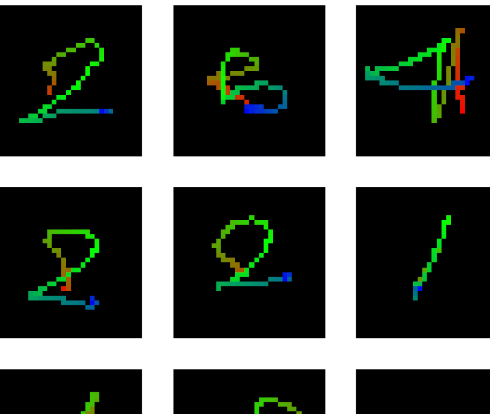
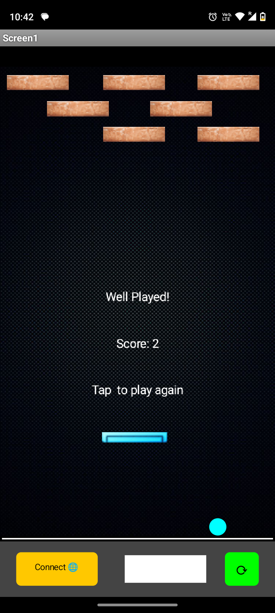
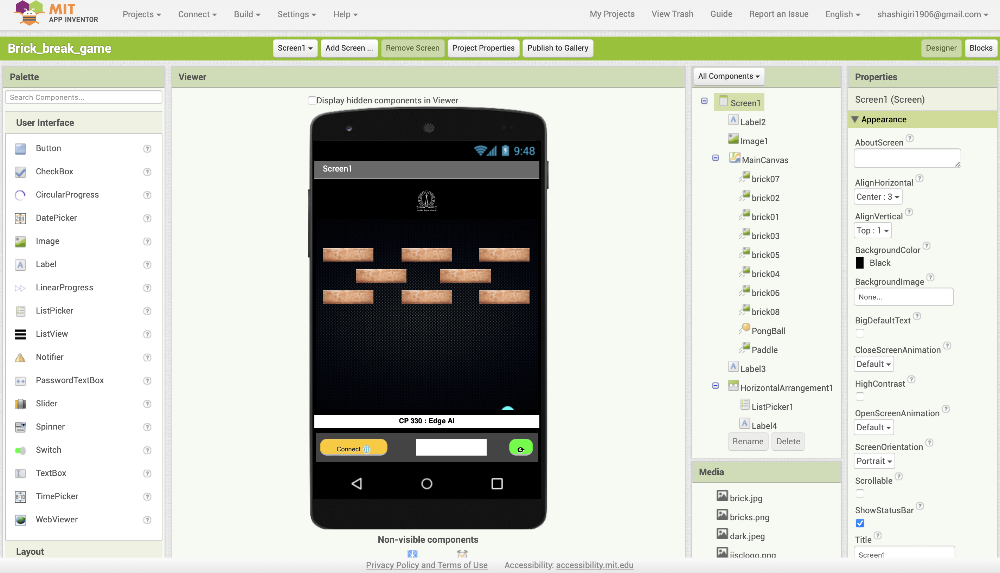
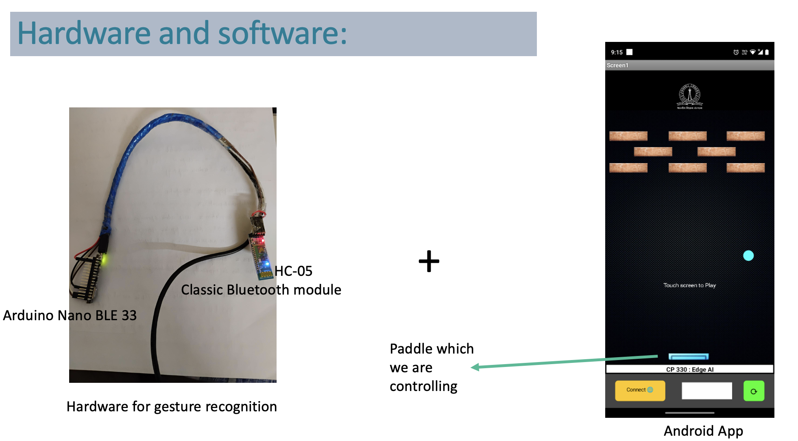

# Interactive Gaming Using Gesture Control

Traditional gaming interfaces like keyboards, mice, and controllers can be restrictive, limiting player immersion and excluding those with physical limitations. They often rely on complex button combinations and manual dexterity, creating barriers for players with mobility issues or those unfamiliar with gaming hardware. Additionally, conventional gaming setups tend to promote sedentary behavior, which can lead to health concerns.

In this project, we'll develop a gesture recognition system for interactive gaming, providing a more inclusive and engaging experience. The following steps outline the process:

## Steps to Create a Gesture Recognition System

### Step 1: Create Custom Data
- Visit [this link](https://tinyml.seas.upenn.edu/magic_wand_capture.html) to create custom gesture data.
- Use the `projectwork.ino` file provided in this repository to set up your Arduino for data capture.
- 

### Step 2: Train the Gesture Recognition Model
- Open the Jupyter Notebook (.ipynb) in Google Colab.
- Train and fine-tune the gesture recognition model following the instructions in the notebook.
- Use the `xxd` tool to generate a .cc file with the trained model data.

### Step 3: Integrate Model Data into Arduino Project
- Replace the `magic_wand_model_data` in the `projectwork.ino` file with the content of your generated .cc file.
- Update the label number and the label names to match your custom data.

### Step 4: Compile and Upload the Code
- Compile the Arduino code and upload it to your Arduino Nano BLE 33.
- Ensure that the code runs without errors and that the device can recognize gestures.

### Step 5: Develop a Bluetooth App

- Create a mobile application to establish Bluetooth communication with your Arduino Nano BLE 33.
- Implement the logic to receive the classified gesture data and trigger appropriate actions in your app.
- one MIT app inventor application project file running in this proect is given which you can directly download and install in your phone or customize as per your needs.
- 

## Conclusion
By following these steps, you'll develop a gesture recognition system for interactive gaming, offering a more immersive and inclusive experience. This project is designed to make gaming more accessible and interactive, with the potential to reduce sedentary behavior and increase player engagement.

## References
(i) https://appinventor.mit.edu/
(ii) https://tinyml.seas.upenn.edu/magic_wand_capture.html
(iii) https://youtu.be/KV7tP3rMXLI
(iv) https://youtu.be/Myir5BqgJJc
(v) https://youtu.be/Hx0do6Sj0M0
(vi) https://jsonlint.com/

